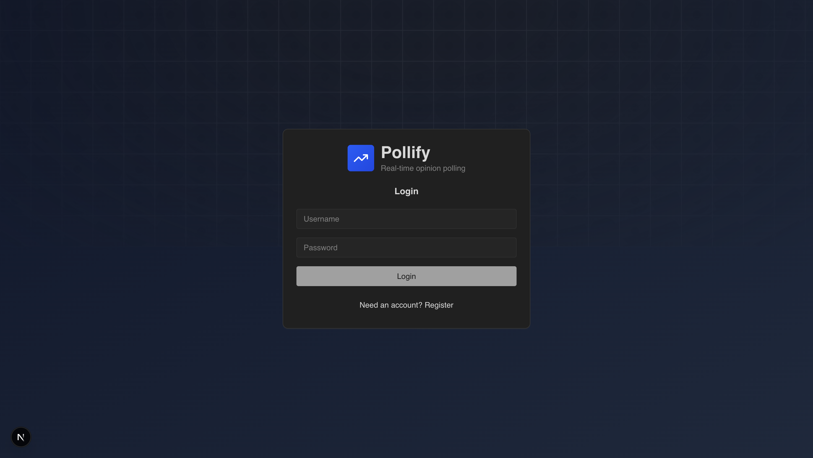
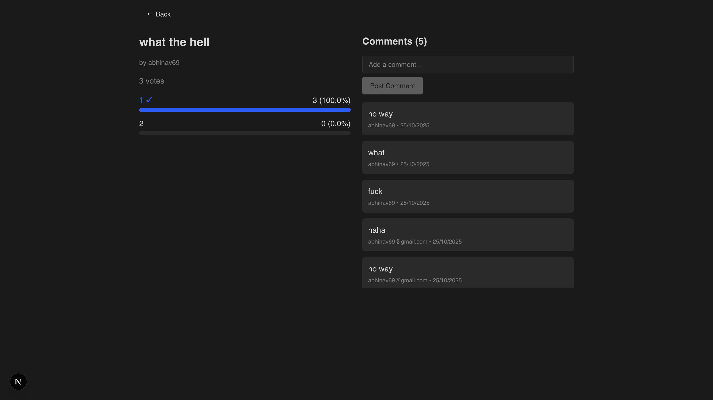
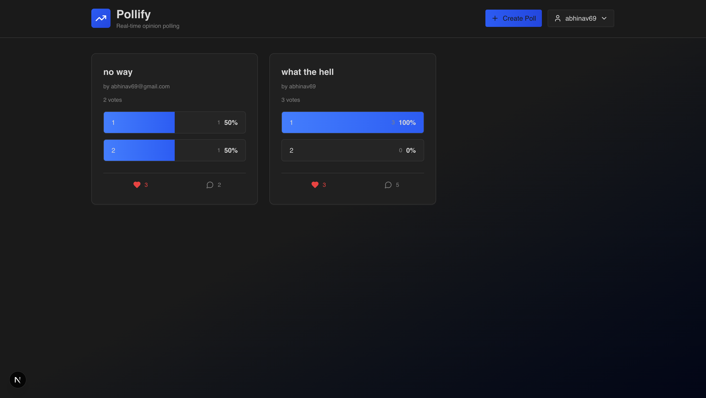

# Pollify

A real-time polling application built with Next.js and FastAPI that allows users to create polls, vote, comment, and interact with each other's content.

## Screenshots

### Login Page

*Modern login interface with animated ripple background effect*

### Home Page

*Clean dashboard showing all polls with real-time updates*

### Poll Details

*Interactive poll page with voting, comments, and live results*

## System Design and Architecture

### Architecture Overview
Pollify follows a modern full-stack architecture with clear separation between frontend and backend services:

```
┌─────────────────┐    HTTP/REST API    ┌─────────────────┐
│   Frontend      │◄──────────────────►│   Backend       │
│   (Next.js)     │                    │   (FastAPI)     │
│   Port: 3000    │                    │   Port: 8000    │
└─────────────────┘                    └─────────────────┘
                                                │
                                                ▼
                                       ┌─────────────────┐
                                       │   Database      │
                                       │   (SQLite)      │
                                       └─────────────────┘
```

### Frontend Architecture (Next.js 16)
- **Framework**: Next.js 16 with TypeScript and App Router
- **Styling**: Tailwind CSS with custom components
- **State Management**: React Query (@tanstack/react-query) for server state
- **Authentication**: JWT tokens stored in localStorage
- **UI Components**: Radix UI primitives with custom styling
- **Real-time Updates**: Polling every 3 seconds for live data

### Backend Architecture (FastAPI)
- **Framework**: FastAPI with Python 3.12
- **Database**: SQLAlchemy ORM with SQLite
- **Authentication**: JWT-based authentication with bcrypt password hashing
- **API Design**: RESTful endpoints with Pydantic validation
- **Real-time**: WebSocket support for future real-time features

### Database Schema
```sql
Users: id, username, password_hash
Polls: id, question, options (JSON), creator_id, created_at
Votes: id, poll_id, user_id, option, created_at
Comments: id, poll_id, user_id, content, created_at
Likes: id, poll_id, user_id, created_at
```

### Key Features
- **User Authentication**: JWT-based login/register system
- **Poll Management**: Create polls with multiple options
- **Real-time Voting**: Vote on polls with live result updates
- **Social Features**: Like polls, comment system, view poll statistics
- **Responsive Design**: Mobile-first design with dark/light theme support

## How to Run the Project Locally

### Prerequisites
- Docker and Docker Compose
- Git

### Quick Start with Docker (Recommended)

1. **Clone the repository**
   ```bash
   git clone https://github.com/AbhinavShaw09/pollify.git
   cd Pollify
   ```

2. **Start with Docker Compose**
   ```bash
   docker-compose up --build
   ```

3. **Access the application**
   - Frontend: http://localhost:3000
   - Backend API: http://localhost:8000
   - API Documentation: http://localhost:8000/docs

### Manual Setup (Alternative)

#### Backend Setup
```bash
cd backend
pip install poetry
poetry install
python main.py
```

#### Frontend Setup
```bash
cd frontend
npm install
npm run dev
```

### Environment Configuration
The application uses default configurations suitable for local development:
- Database: SQLite file (`polls.db`) created automatically
- CORS: Configured for localhost:3000
- JWT: Uses default secret (change for production)

## Research and APIs/Resources Used

### Frontend Technologies
- **Next.js 16**: Latest React framework with App Router for modern development
- **Tailwind CSS**: Utility-first CSS framework for rapid UI development
- **Radix UI**: Accessible, unstyled UI primitives for building design systems
- **React Query**: Powerful data synchronization for React applications
- **Lucide React**: Beautiful & consistent icon library
- **Aceternity UI**: Background ripple effect component for enhanced UX

### Backend Technologies
- **FastAPI**: Modern, fast web framework for building APIs with Python
- **SQLAlchemy**: Python SQL toolkit and Object-Relational Mapping library
- **Pydantic**: Data validation using Python type annotations
- **python-jose**: JavaScript Object Signing and Encryption library for JWT
- **passlib**: Password hashing library with bcrypt support
- **uvicorn**: Lightning-fast ASGI server implementation

### Development Tools
- **Docker**: Containerization for consistent development and deployment
- **Poetry**: Dependency management and packaging for Python
- **TypeScript**: Type-safe JavaScript development
- **ESLint**: Code linting and formatting

### Design Resources
- **Color Palette**: Blue gradient theme (blue-600 to blue-700)
- **Typography**: Geist font family for modern, clean text
- **Icons**: TrendingUp icon for branding, various Lucide icons for UI
- **Layout**: Card-based design with responsive grid layouts

### API Design Patterns
- **RESTful Architecture**: Standard HTTP methods and status codes
- **JWT Authentication**: Stateless authentication with Bearer tokens
- **Pydantic Models**: Request/response validation and serialization
- **Error Handling**: Consistent error responses with proper HTTP status codes

### Performance Optimizations
- **React Query Caching**: Intelligent caching and background updates
- **Docker Multi-stage Builds**: Optimized container images
- **SQLite**: Lightweight database perfect for development and small deployments
- **Real-time Polling**: 3-second intervals for live updates without WebSocket complexity

## Contributing

1. Fork the repository
2. Create a feature branch
3. Make your changes
4. Submit a pull request

## License

MIT License
